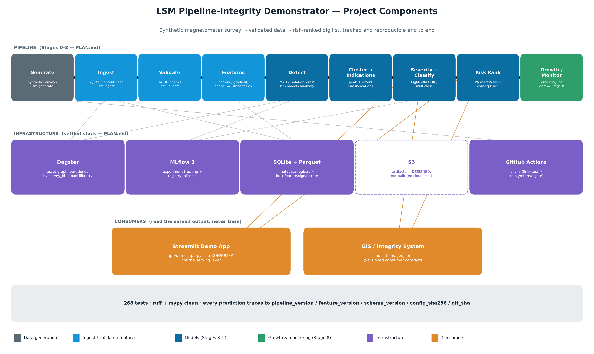
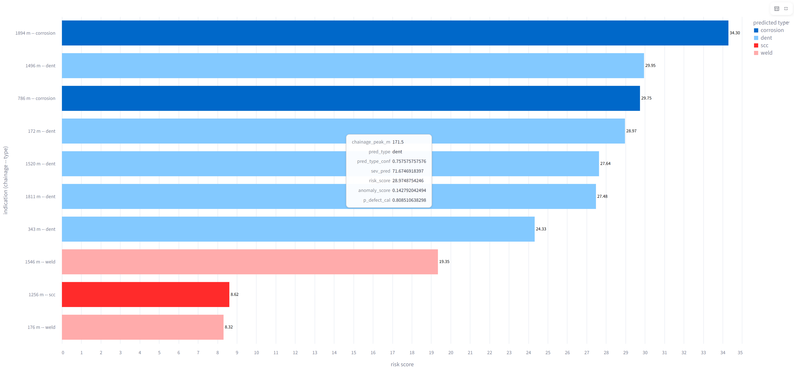

# LSM Pipeline Integrity — an ML Lifecycle Demonstrator

A physicist's end-to-end ML pipeline that turns 3-axis magnetometer + GPS survey data into
a prioritised, risk-ranked dig list: ingest → validation → feature engineering → detection →
severity/classification → risk ranking → growth & remaining-life, orchestrated with Dagster,
tracked with MLflow, served through a Streamlit app, gated by CI. Built to demonstrate
**methodology and MLOps discipline**, not physical fidelity.

Real Large Stand-Off Magnetometry (LSM) data is proprietary, so a physics-inspired synthetic
generator (a magnetic-dipole forward model over a drifting geomagnetic background, optionally
a real USGS observatory trace) stands in for it. Every result reported anywhere in this
project — including results that don't clear their own gate — is real, measured on that
synthetic corpus, not cherry-picked.



## Repo layout

```
.
├── src/lsm/                 the pipeline
│   ├── generate.py          synthetic survey generator (dipole model + real background option)
│   ├── ingest.py            raw -> SQLite, content-hashed, idempotent
│   ├── validate.py          14 data-quality checks, quarantine on hard failure
│   ├── features.py          detrend, along-track/vertical gradient, window + peak-shape features
│   ├── indications.py       row scores -> clustered indications, severity/classify attachment
│   ├── models/               anomaly.py (MAD/IsolationForest), severity.py (LightGBM CQR),
│   │                         classify.py (LightGBM multiclass)
│   ├── train.py              grouped CV, gate evaluation, model persistence
│   ├── predict.py            batch inference on one survey -> indications + GeoJSON
│   ├── growth.py             partially-pooled growth rate -> remaining life
│   ├── monitor.py            drift monitoring (PSI/KS vs. training reference)
│   ├── dagster_defs.py       the asset graph
│   └── bundle.py, db.py, config.py, schemas.py, hashing.py   the contracts everything else relies on
├── app/                     the Streamlit demo app
│   ├── demo_app.py           entry point -- landing screen, workflow diagram, model performance,
│   │                         signal views, ranked indications, corrupted-survey refusal
│   ├── demo_lib.py            Streamlit-free seam: demo/live mode logic, testable without a browser
│   └── chart_utils.py, map_utils.py   Altair/pydeck chart builders
├── config/                  base.yaml (hashed into config_sha256) + dev.yaml/prod.yaml (not hashed)
├── serving/                 baked demo artifact: model bundles + 4 demo scenarios + manifest
├── scripts/                 EDA, plotting, the scale rehearsal, baking the demo artifact
├── tests/                   276 tests
└── .github/workflows/       ci.yml (lint+type+test, every push) / train.yml (the real promotion gate)
```

## Designed for production, built on synthetic data

Every engineering decision here is made the way it would need to be made against real data,
even though the data itself is synthetic:

- **A declared data contract, not a loose CSV.** Schema, dtypes, units, and null policy
  declared once (`schemas.py`) and validated at every boundary.
- **Idempotent, content-hashed ingest.** The same bytes twice is a no-op; a changed hash under
  an existing key is a hard error, never a silent overwrite.
- **14 real data-quality checks**, quarantine — not crash — on failure. A pipeline that halts
  a nightly run over one bad sensor gets switched off by its own operators.
- **Everything that can silently go stale is versioned**: `feature_version`, `schema_version`,
  and `pipeline_version` — the actual deployable unit (up to four models plus a feature
  version, promoted and rolled back together, never one model in isolation).
- **Hard version guards, not soft warnings.** Loading a model bundle trained against a
  different `numpy`/`scikit-learn`/`lightgbm` fails loudly at load time — a silent
  minor-version difference is exactly the failure mode that doesn't show up until predictions
  are already wrong.
- **Grouped, leakage-aware evaluation.** Splits by line/block, never randomly; point-in-time
  correctness enforced by an as-of join, not just a spatial split.
- **Real orchestration, not a notebook.** A Dagster asset graph partitioned by survey, with a
  resumable backfill demonstrated by killing a run mid-flight and confirming no reprocessing.
- **A real CI/CD promotion gate.** `train.yml` runs the actual statistical gate and blocks a
  candidate that doesn't clear it — demonstrated for real, since the current candidate
  genuinely doesn't clear it, not hypothetically.

What's explicitly **not** built, and why: cloud artifact storage (S3) and a real deploy
pipeline are designed but not wired up, because no cloud account exists for this
demonstrator — standing up real infrastructure nobody will ever point at a real bucket would
be theatre, not rigor. The gap between designed and built is stated wherever it matters, not
glossed over.

## Quickstart

```bash
conda create -n ml_gpu python=3.12
conda activate ml_gpu
pip install -e ".[dev]"

python -m lsm generate    # synthetic surveys -> data/raw/*.parquet
python -m lsm ingest      # raw -> SQLite, with content hashing + DQ quarantine
python -m lsm features    # background removal + feature engineering
python -m lsm train       # trains + evaluates the real detection/severity/classification gates
python -m lsm forecast    # growth rate -> remaining life, vs. a no-growth baseline
python -m lsm predict <survey_id>   # batch inference on one survey
python -m lsm serve       # launch the demo app (or: streamlit run app/demo_app.py)
```

`lsm serve` opens a Streamlit app with two modes: `demo` (precomputed results from the
committed `serving/` artifact, zero compute, cannot fail) and `live` (re-runs the real
`validate → features → score` pipeline on the spot, ~1s) — same code either way. After
retraining, `python scripts/bake_demo_assets.py` refreshes `serving/` with the new models.

## Testing

```bash
pytest              # 276 tests
ruff check .
mypy src
```

Dependency versions that `bundle.py` hard-checks at load time (`numpy`, `scikit-learn`,
`lightgbm`) are pinned in `pyproject.toml` to match what the committed `serving/` bundles were
actually trained with — a fresh install that drifted from those versions would either fail the
bundle's own version guard or silently score differently with no error.

The Streamlit app is tested headlessly via `streamlit.testing.v1.AppTest`, which runs the
actual script through Streamlit's real runtime rather than a hand-written approximation of it.

---

Real output from a trained model — the demo app's ranked-indications view, dig-budget-limited,
sorted by `risk_score` (calibrated P(defect) × severity × a stated consequence proxy):



## License

MIT — see [`LICENSE`](LICENSE).
