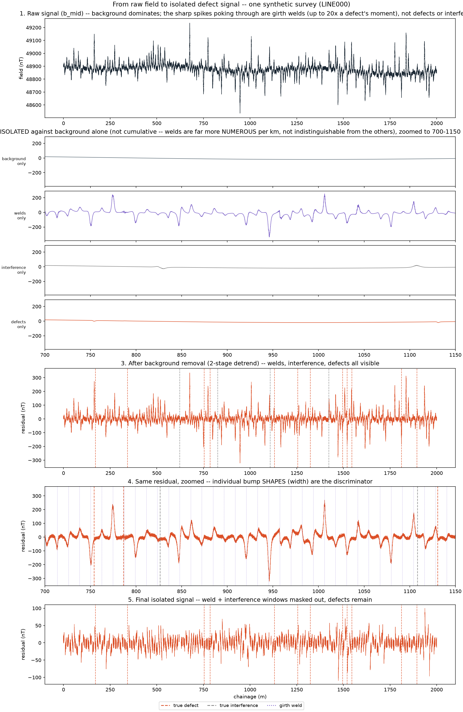
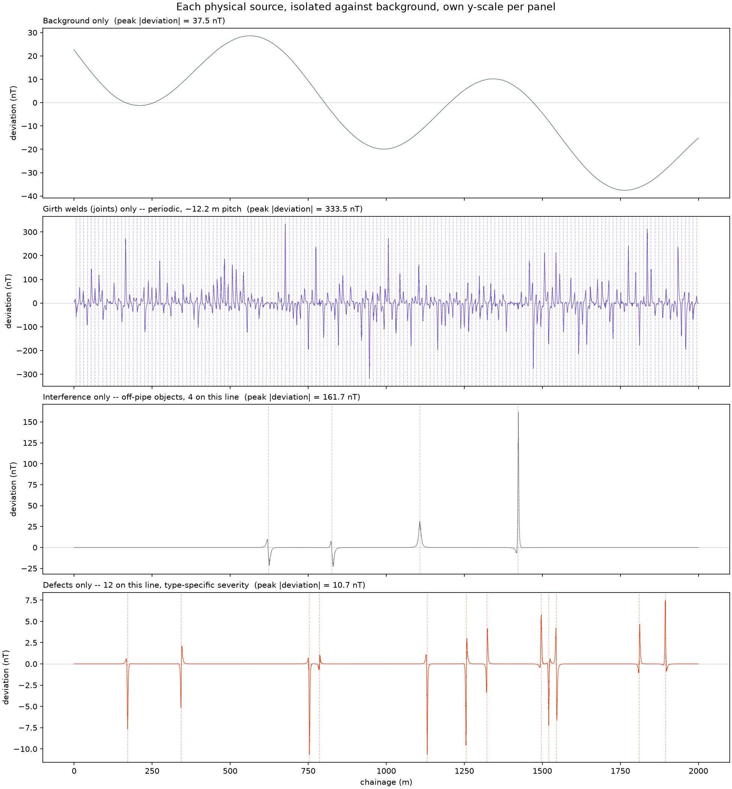

# I'm a Physicist. Here's What Six Months of Building an ML Pipeline Taught Me About Everything I Was Doing Wrong.

*Magnetometer data, buried pipelines, and the uncomfortable discovery that the modelling was the easy part.*

---

I know magnetism. I can tell you why a stress-concentration zone in a steel pipe wall perturbs the local field, and I can trace it down to the microstructure: the Villari effect, dislocation pile-ups at a crack tip acting as a barrier to flux lines, forcing them out of the wall. Give me a signal and a physical hypothesis and I am on home ground.

What I could not do, eighteen months ago, was ship any of that as software someone else could trust.

This is a walkthrough of a project I built to close that gap — an end-to-end pipeline that takes magnetometer and GPS survey data over a buried pipeline and produces a risk-ranked dig list. It covers the concept, the synthetic data generator, validation, feature engineering, training, evaluation, and inference. (The instrument model I started with turned out to be wrong, and about two-thirds of the way through the project I found out why. That part gets its own section below, because it changed the physics of the whole problem.)

I want to be straight about two things up front, because they shape everything below.

**First: the data is synthetic.** Real Large Stand-Off Magnetometry (LSM) data is commercially proprietary. I don't have any. So I built a physics-inspired generator instead, and every number in this article is measured on that synthetic corpus.

**Second: the headline model doesn't work.** The candidate detection model fails its own promotion gate. It fails in CI, on purpose, and the CI job goes red. I'll explain why I think that's the most valuable thing in the repository.

---

## The problem: reading a pipe you can't touch

Buried pipelines corrode, crack, and get dented by excavators. The gold-standard inspection is an in-line inspection tool — a "pig" — driven down the inside of the pipe. But a large fraction of the world's pipeline network is *unpiggable*: no launch traps, tight bends, varying diameter.

Large Stand-Off Magnetometry is one answer. You walk a magnetometer along the ground above the buried line and infer the pipe's condition from the field it perturbs. It's genuinely appealing physics: no excavation, no shutdown, no product interruption.

It is also a brutally hard inverse problem, and the reason is a signal-to-background ratio that should make anyone uncomfortable.

In my corpus, the ambient geomagnetic field is around 45,000 nT. The defect signal, after background removal, is about **25 nT** — roughly **0.05% of the raw field**. You are looking for a five-hundredth of a percent perturbation, riding on a background that drifts as you walk.

That single ratio dictates the entire architecture. Background removal isn't preprocessing here. It *is* the problem.

And there's a second trap. A magnetometer doesn't know what's steel and what isn't. A buried fence post, a length of scrap, a casing, a parallel utility line — all of them produce a localised magnetic anomaly that looks, in amplitude, exactly like a defect. If your detector is an amplitude threshold, every piece of buried junk on the right-of-way becomes a dig recommendation. Digs cost tens of thousands of dollars each.

So the real task isn't "find the anomalies." It's "find the anomalies that are *defects*." That distinction turned out to be the technical spine of the whole project.

---

## Part 1: No data? Then the generator is your first model

The instinct when you can't get data is to give up or to find a proxy dataset. I did something else: I wrote a forward model.

Physicists are comfortable here. If I know the physics, I can generate observations. A stress-concentration zone behaves, to first order and from a distance, like a magnetic dipole. So:

```python
COUPLING = 3.0

def dipole_field(r_obs, r_src, moment):
    d = r_obs - r_src
    dist = np.linalg.norm(d, axis=-1, keepdims=True)
    dist = np.clip(dist, 0.05, None)
    rhat = d / dist
    m = np.asarray(moment, dtype=float)
    term = 3.0 * np.sum(rhat * m, axis=-1, keepdims=True) * rhat - m
    return COUPLING * term / dist**3
```

That's the standard static point-dipole field, `B = k·[3(r̂·m)r̂ − m]/r³`, vectorised over every observation point in the survey.

**An honest caveat, stated where it belongs rather than buried:** `COUPLING = 3.0` is *not* μ₀/4π. It's an arbitrary scale constant chosen so the moment magnitudes land at realistic nT amplitudes. The pipe body isn't modelled. There's no induced-versus-remanent magnetisation, no demagnetising factor, no interaction between sources. The module docstring says "physics-inspired, not physically validated," and I mean it. This generator produces data with the right *structure* — the right falloff, the right geometry, the right confusions — not data a magnetostatics referee would accept.

That's a deliberate trade. I needed a corpus where I know the ground truth exactly, so I can measure whether my pipeline recovers it. Physical fidelity would be a different project.

### The corpus

Five independent 2 km lines, sampled every 0.5 m, surveyed three times each. 4,000 samples per survey, 15 surveys, 60,000 rows. Each line carries 12 defects and 4 interference sources.

The sensor sits at the origin plane; sources sit 1.5 m below. Three axes: `bx_nt` along-track, `by_nt` cross-track, `bz_nt` vertical. A second sensor head sits 0.5 m above the first, giving true vertical gradiometry — which matters more than I expected, and not in the direction I expected.

Defects get a severity drawn uniformly from 20–80 %SMYS (percent of Specified Minimum Yield Strength, the standard pipeline-integrity unit), and that severity number *is* the dipole moment magnitude. That's the ground-truth link the severity regressor has to invert back out, through 1/r³ geometry, a random orientation projection, drifting background, and noise.

Across repeat surveys, defects grow geometrically at 15% per survey.

### The traps are the interesting part

Here's the design decision I'm proudest of, and it took me two tries to get right.

Interference sources are large steel objects sitting 3–8 m *off* the line, and their moments are scaled by a factor of 50 relative to defects.

Why 50? Because `(5.5/1.5)³ ≈ 50`. That's exactly the 1/r³ falloff penalty for sitting 5.5 m off-axis instead of 1.5 m below. Without that scale factor, a realistic interference source arrives at the sensor at about 0.9 nT — well under the 5 nT noise floor. It would be invisible, and the false-positive trap would trap nothing. The "interference precision" metric would be vacuous.

With it, interference arrives at **defect-comparable amplitude** — but from a different geometry, so it has a **visibly different shape**. The comment I left in the config is the thesis of the whole project:

> *shape separates it, amplitude does not.*

The measured consequence: on-pipe anomalies have a full-width-half-maximum of about **2.2 m**; off-pipe interference about **6.2 m**. Same height, different width. An amplitude threshold cannot tell them apart, even in principle. A shape feature can.

Later EDA confirmed this quantitatively, and it's the number that ended up steering the model design. The ~20-feature amplitude block (window means, maxima, energy) reaches PR-AUC up to **0.97** for separating defect from background — nearly perfect. For separating defect from *interference*, the same block sits mostly **below 0.55** — barely better than a coin flip. The features that actually work are shape-based: `w25m_kurt` at PR-AUC **0.985**, `w25m_zcr` at 0.786.

### Where the generator fooled me — twice

This is the part I'd most want a younger version of myself to read.

**Self-deception #1: my background was polynomial, so my polynomial detrender looked brilliant.**

The synthetic background is a linear drift plus a single sinusoid. I detrend with a robust polynomial. A degree-5 polynomial fits that background essentially perfectly — it drove the residual down to 5.03 nT against a 5.0 nT sensor noise floor. *Exactly* the noise floor. My detrender wasn't good; my background was a polynomial, and I was fitting a polynomial to a polynomial.

The fix was to go find real data — not for the defects, but for the background. The USGS Geomagnetism Program publishes observatory traces in the public domain. I pulled two from Boulder (BOU): a geomagnetically quiet day, and 10 May 2024 — the G5 "Mother's Day" storm, the largest in two decades. The generator can interpolate a real trace onto chainage and use it as the background instead of the synthetic one.

The result was exactly the reality check I wanted. On the storm trace, a bare degree-5 polynomial leaves **6.9–11.3 nT** of residual — above the noise floor, meaning it does *not* fit real geomagnetic structure the way it fit mine. But my actual two-stage detrend (robust degree-3 polynomial, then a 40 m rolling-median high-pass) held up: background residual of **7.81 nT** synthetic, **8.09 nT** storm, **7.83 nT** quiet, with detection contrast holding at 3.02–3.21× across all three.

So the pipeline survived contact with real background physics. But I only know that because I went looking for a way to prove myself wrong.

It's off by default, incidentally, and the config says why: the storm residual would break the detectability gate if left on. It's a stress test, not the operating point — stated, rather than quietly disabled.

**Self-deception #2: my gradiometer had perfect common-mode rejection, because I built it that way.**

Gradiometry is the classic trick for this problem: two sensor heads, subtract, and the spatially-uniform background cancels while the near-field source term survives.

My first implementation built the second head's reading from *the same* drift and wave arrays as the first. Which meant the background's vertical gradient was **exactly zero, by construction**. The measured head difference was pure sensor noise, σ√2. I had built a simulator in which my gradiometer could not fail.

Fixing it meant modelling what actually varies between two heads 0.5 m apart: the main field's real vertical gradient (~0.02 nT/m) and, dominantly, geology — modelled as its own spatially-varying term. The head-difference standard deviation went from 6.91–7.02 nT (pure noise) to 6.98–8.37 nT, i.e. about 2.4 nT of real background gradient.

And then the honest result: **the gradiometer is worse.** Detection contrast is 3.21× for a detrended single head versus **1.45×** for the vertical gradiometer. The difference operation cancels the background but accumulates sensor noise from both heads (σ√2), and after detrending has already removed most of the background, you've paid the noise cost for a benefit you already had.

That's a negative result about a technique the field considers standard. It's in the repo, stated as such. The gradiometer earns its place when the background is highly non-uniform along-track — not here.

That was true of the instrument I believed I was building for. Later — after the validation layer, the feature layer, the training and evaluation machinery all covered below — I found out that instrument does not exist, and had to rebuild the physics underneath everything above it. That story gets its own section, after Part 5.

---

## Part 2: The part physicists skip

In the lab, my data validation was "look at the plot; if it's weird, investigate." That does not survive contact with a pipeline that runs nightly on data nobody eyeballs.

So the first real stage is a data-quality layer: **14 checks**, run against every survey at ingest. Seven are hard failures, seven are warnings, and *which* is which is configuration, not code.

The hard ones: schema conformance, physical range, sensor saturation (three or more consecutive identical raw values — a stuck ADC), sample-index monotonicity, duplicate indices, duplicate content, and survey overlap. The soft ones cover index gaps, GPS jumps, GPS-versus-chainage consistency, noise floor, background regime shift, interference density, and coverage.

Two design decisions in there took me a while to appreciate.

**Quarantine, don't crash.** When a survey fails a hard check, the pipeline does not raise. It writes all 14 verdicts to a `dq_report` table, marks the survey `quarantined`, copies the raw file plus a JSON report into a quarantine directory, and *carries on with the other surveys*. The Dagster asset for a quarantined partition yields `{"outcome": "skipped"}` rather than failing the run.

The reasoning, which I've since seen borne out everywhere: a pipeline that halts a nightly run over one bad sensor gets switched off by its own operators. Refusing to score bad data is correct behaviour, and correct behaviour should not look like a crash.

**Immutable, content-addressed ingest.** Every survey gets two hashes. `file_sha256` over the raw bytes — provenance, "this exact artifact." And `content_sha256` over a canonicalised form: a fixed column list in declared order, sorted by sample index, floats rounded to 6 decimals, hashed over the Arrow buffers.

Ingest is keyed on `(line_id, run_id)`. Same key, same content hash → no-op, logged, nothing written. Same key, *different* hash → a hard `IngestConflictError`:

> `raw data is immutable, refusing to overwrite`

That error has saved me more times than any test. The failure mode it prevents — data silently changing under a key you've already trained against — is invisible until your metrics move and you cannot explain why.

There's a subtlety I got wrong first time, too: the feature-store cache key is `content_sha256` **plus** `feature_version`. The content hash alone isn't enough, because the data is identical after I change `features.py` — and that's precisely the training/serving skew no data check can see.

### A data contract, not a convention

Schema, dtypes, units, and null policy are declared once, in `schemas.py`, using pandera, and validated at every boundary. Two rules, both learned the hard way:

**Never coerce.** The schemas are `coerce=False`. A boundary that repairs its input is a boundary where skew hides.

**Closed categories with pinned order.** `DEFECT_TYPES` is a fixed list, in a fixed order, serialised into every model bundle — because an alphabetical reshuffle would silently permute a classifier's output columns.

And a small one I'd never have thought about as a physicist: latitude and longitude are `float64`, mandatory. Not for precision aesthetics — because float32 ULP at 47°N is about 0.42 m, comparable to my 0.5 m sample spacing. Storing GPS as float32 would quantise the survey.

---

## Part 3: Features — where the physics earns its keep

The feature layer is where domain knowledge actually pays, and it's 46 columns in four blocks.

**Detrending** is two passes. A robust degree-3 polynomial fit by iteratively reweighted least squares with a Tukey biweight (so a defect doesn't drag the baseline toward itself), then a 40 m rolling-*median* high-pass. Median, not mean, so a defect occupying a small fraction of the window doesn't get partly subtracted by its own presence. The window has to stay much wider than a defect's footprint or the high-pass eats the signal it exists to expose.

**Gradients**, in two genuinely different senses. Along-track derivatives of the residual magnitude (first and second), and true vertical gradiometry from the second head.

**Sliding-window statistics** at 2, 5, 10, and 25 m: mean, standard deviation, max, peak-to-peak, kurtosis, zero-crossing rate, and energy.

One small detail I'm glad I caught: zero-crossing rate is computed on `rz` — the signed vertical residual — not on the residual *magnitude*. A magnitude is non-negative and never crosses zero, so `|r|`-based ZCR would be identically zero. A feature that looks computed and isn't.

**Peak shape** — the block that does the actual work:

- `fwhm_m` — full width at half maximum. The 2.2 m versus 6.2 m discriminator.
- `peak_asymmetry` — normalised by width, so it measures shape rather than size.
- `decay_exponent` — the log-log slope of the flanks, fit in units of FWHM so it's scale-invariant, bounded at the midpoint to neighbouring peaks so a neighbour's rise isn't fitted as this peak's fall.
- `peak_prominence_nt`, `peak_distance_m`.

`decay_exponent` is worth dwelling on because it's a feature that *didn't* work as intended. I expected the falloff exponent to separate on-pipe from off-pipe sources. Measured: −0.95 versus −0.84. It doesn't separate them. I kept it anyway, because it does measure how dipole-*like* an anomaly is, and I documented the negative finding next to the feature rather than quietly dropping it.

There's also a structural decision that prevents an entire class of bug. Feature transforms are split by type signature into *stateless* (`(survey, context) → DataFrame`, no corpus access, so cross-survey leakage is impossible by construction) and *fitted* (an abstract base class that raises on double-fit, since fitting twice is training/serving skew). The leakage protection is in the type, not in a code review.

### From rows to indications

Row-level scores aren't decisions. An engineer doesn't dig a row; they dig a location.

So contiguous runs of above-threshold rows collapse into a single **indication**, with a peak location, a start and end chainage, and lat/lon from the peak row. The indication ID is a deterministic hash of survey, pipeline version, and peak chainage — so re-running inference is idempotent.

Then the **dig budget**: 5 digs per km, so 10 for a 2 km survey. Every metric that matters is measured on that top-10 slice, because that's all anyone will ever excavate. The database stores the full candidate list; the budget is a serving-time ranking choice, not a filter applied to the stored truth.

---

## Part 4: Training, and learning to distrust my own results

Four models: anomaly detection (unsupervised), severity regression, defect classification, growth forecasting.

### Detection

Two candidates. A **MAD baseline** — robust z-score on residual magnitude, thresholded at the 97th percentile of training scores. Deliberately amplitude-only, deliberately dumb.

And an **IsolationForest** over all 46 features, which should be able to use shape.

Then a problem I found only by doing the EDA: IsolationForest picks its split feature *uniformly at random*. The ~20-column amplitude block outnumbers the three genuine defect-versus-interference discriminators about 7 to 1. So an isolation path rarely uses the features that actually matter.

The workaround was to tile the discriminating columns five times in the fitted matrix, raising their selection probability without touching the bundle-pinned feature list:

```yaml
emphasize_features: [w25m_kurt, w25m_zcr, w10m_kurt]
emphasis_repeats: 5
```

It's a hack. It's labelled as one.

### Severity, with calibrated uncertainty

A point prediction of "this defect is at 62 %SMYS" is not a usable input to a dig decision. You need an interval, and the interval needs to mean what it says.

Three LightGBM quantile regressors at 0.05, 0.5, and 0.95, wrapped in **conformalised quantile regression** (Romano et al., 2019). On a disjoint calibration set, compute a nonconformity score per point, take the appropriate quantile, and widen the raw interval by that margin. The result carries a finite-sample coverage guarantee.

One line in there is not cosmetic:

```python
level = min(1.0, np.ceil((n + 1) * (1 - alpha)) / n)
```

That `(n+1)/n` correction is the difference between the theory holding and not holding at small n. Without it, measured coverage came out around **73%** against a 90% nominal. With it, 92%. If you implement conformal prediction and skip that term, your intervals are a false promise.

### Classification

Five classes — SCC, weld, dent, corrosion, interference — via LightGBM multiclass with isotonic calibration on a held-out split, where the split is by *physical defect*, class-stratified, never a bare row shuffle (a rare class can otherwise get zero calibration examples).

Separately, an isotonic map produces a calibrated `P(defect)` from the anomaly score, fitted on the *unfiltered* matched population — matched defects, matched interference, **and unmatched false alarms** — precisely because the classifier itself never sees true false alarms.

Risk score, finally:

```
risk_score = p_defect_cal × sev_pred × consequence_proxy[pred_type]
```

with weights SCC 1.0, corrosion 0.6, dent 0.5, weld 0.4, interference **0.0**. Those weights are stated engineering judgment, not derived from data — labelled as such in the config, the model card, and the README, and meant to be replaced wholesale once real consequence data (population density, product type, MAOP) exists. Interference is zeroed so it can never dominate a dig ranking.

### Evaluation: the part that changed how I think

This is where I stopped being a physicist doing ML and started being an engineer.

**Grouping.** Cross-validation folds are grouped by `(line_id, 100 m block)`, never by block alone — two overlapping surveys of the same physical stretch must not land in different folds. Fold assignment is by *hash* of the group key, not position, so growing the archive never reshuffles existing folds.

**Bootstrap resampling unit.** This is the one I'd tattoo on something. My three surveys re-observe the *same* 12 defects. That's 12 independent physical objects, not 36 observations. So every confidence interval resamples over the right unit — per physical defect for recall, per survey for false-dig rate, per matched dig for localisation error, per source for classification recall. Resampling rows would have produced beautifully tight, completely fictional intervals.

And for model comparison, a **paired** bootstrap: the same resampled indices for both models, because the two models' per-defect hit rates are correlated (same defects). Two independently-bootstrapped CIs can overlap while the paired difference is positive on every single resample.

**ROC-AUC is banned outright.** Positives are ~2.7% of rows. ROC flatters that beyond usefulness. PR-AUC is computed and explicitly labelled a diagnostic; the gate is indication-level recall at dig budget.

**Matching is greedy and exclusive.** No truth source can be claimed twice, so a second dig near an already-matched defect scores as a false dig, not a second true positive.

### The gates

Four promotion gates, and their exact thresholds:

- **Detection:** IsolationForest must beat MAD by ≥ 0.15 mean per-defect recall at the **CI lower bound**.
- **Severity:** conformal coverage in [0.87, 0.93] — two-sided, because too high is uselessly wide.
- **Classification:** SCC recall ≥ 0.90 at the CI lower bound, ANDed with a **physics-consistency check**: no absolute-position feature (`chainage_m`, `sample_idx`, …) may appear in the top 10 by TreeSHAP contribution. If position predicts defect type, the model has memorised the corpus.
- **Growth:** must beat a no-growth baseline on one-step-ahead MAE at the CI lower bound.

Note the recurring phrase. Nearly every gate is on the **CI lower bound**, not the point estimate. A model that beats baseline on the point estimate but not at the lower bound has not demonstrated anything.

---

## Part 5: The model failed. Then I spent a week proving the failure was real.

Here's the demo-corpus result:

```
Recall gap (IsolationForest − MAD): −0.006  [−0.067, 0.050]
Stage 3 gate (≥ 0.15 at the CI lower bound): DID NOT PASS
```

The candidate is *worse* than a robust z-score threshold. But look at that interval: [−0.067, +0.050]. It straddles zero. With 60 physical defects, I could not distinguish "IsolationForest is slightly worse" from "I have no idea."

An underpowered negative result is not a result. So the question became: is this a real effect, or is my corpus too small to resolve it?

The wrong fix was tempting and I tried it first — pack 60 defects onto one line. Measured outcome: the background-contrast gate degraded from 3.19× to ~2.7–3.0×, because dense packing means background rows increasingly sit inside a neighbour's 1/r³ tail. More data, worse data.

The right fix was more *independent* lines, which narrows the interval by roughly √5 without touching defect density. Scaled all the way up: 40 lines × 40 km × 3 runs = **9.6 million rows**, holding density constant at 6 defects/km.

```
Recall gap (IsolationForest − MAD): −0.029  [−0.033, −0.026]
Stage 3 gate: DOES NOT PASS
```

There it is. At 800× the defects, the interval collapses to a tight band that excludes zero. IsolationForest is genuinely, reproducibly, if slightly, **worse** than a robust MAD threshold on this corpus. Not noise. A real, small, negative effect.

And the diagnostic explains the mechanism honestly: MAD wastes *more* of its dig budget on interference than IsolationForest does — so IsolationForest is doing the thing I designed it to do, just not by enough to overcome its worse localisation.

`lsm train`'s exit code *is* that gate. It exits non-zero. The GitHub Actions "Train" workflow is therefore red, and it is supposed to be. The badge that reflects code health is the separate CI workflow — lint, type-check, 312 tests — kept deliberately apart so that a legitimate model failure never masquerades as broken code, and broken code never hides behind a model excuse.

Nothing has ever been promoted. Every release row in the database is stamped `alias: "challenger"`.

### The scale run also found three real bugs

Running at 9.6M rows surfaced things 60,000 rows never could:

**A 0.4% data issue cascading to 0% coverage.** The generator initialises severity to NaN off-defect. Occasionally a detected peak lands just outside a defect's label window while still inside the dig-matching radius — 36 of 18,917 matched indications, 0.4%. A single NaN reaching the conformal calibration NaN'd the entire fold's margin (`np.quantile` propagates NaN), which NaN'd every interval in that fold. A 0.4% data problem became **0% coverage across the whole result**. Not gradual degradation — a cliff.

**Config that was silently dead.** `n_estimators` and `num_leaves` for the classifier were never threaded from config into the model. Editing them had no effect whatsoever, silently, because they happened to match the hardcoded defaults. Found only because the scale config's larger values changed nothing. Fixing it moved SCC recall from 0.50 to 0.64.

**Hyperparameters that don't survive scaling.** The demo config uses `num_leaves: 7` and `min_child_samples: 3`, because LightGBM's defaults refuse to split at all on 60 defects. Applied unchanged at 9,600 defects, that same `num_leaves: 7` caps the quantile trees regardless of data volume and collapses conformal coverage to **0%**. Small-data accommodations are not production defaults, and I only learned that by running both.

### The gates that did pass — and one that passed too easily

Severity coverage: **0.920** against a 0.90 nominal at demo scale, 0.896 at production scale. That one works, and it's the result I trust most.

Classification: SCC recall 0.636 [0.620, 0.652] at scale — far better than the majority baseline's 0.000, but nowhere near the 0.90 gate. Interference precision, though, is **0.999**: the model has essentially solved "is this a pipe defect or a buried fence post," which was the hard problem I set out to solve. *(I retract this later in the piece — see "Running it at scale, and retracting my best result." The number is real, but it belongs to this three-axis instrument, and it does not survive on the real one.)* The physics-consistency SHAP check passes — top features are `w25m_kurt`, `r_decl_deg`, window statistics. Shape and orientation, not position.

Growth: the gate passes, with a one-step-ahead MAE of effectively zero against a baseline of 9.8. **I don't think that result means much, and it's worth saying why.** My generator applies growth as a deterministic geometric law with no per-defect noise. A correctly-implemented pooled log-linear estimator recovers ln(1.15) = 0.1398 essentially exactly — and the measured population rate is 0.13976. That's a good unit test of the estimator. It is *not* evidence the method works on real defect growth, which is noisy, heterogeneous, and not geometric. The gate passing here mostly tells me I didn't make an arithmetic error.

The model card says this in the artifact itself, alongside the number: with as few as three observations per defect, per-defect rates are almost entirely shrunk to the population rate, so every remaining-life figure is provisional rather than a calibrated forecast.

---

## The interview that rewrote the instrument

Everything in Parts 1 through 5 was built around one mental picture of the hardware: a 3-axis vector magnetometer, `bx_nt`/`by_nt`/`bz_nt`, riding a cart on a fixed 0.5 m grid, with an optional second head 0.5 m above it for gradiometry. I was confident in that picture. It matched a technical flyer, it matched general domain knowledge about magnetometer surveys, and it produced clean, checkable physics.

Then I did a second-round interview with Richard Föcke, the developer who actually built the real instrument. He described a different machine.

The real rig is a rod carrying three total-field magnetometers — a middle head and two more, 50 cm apart. It is carried by a person walking the line, at whatever speed and stand-off a person actually holds, not a cart moving at a fixed rate on rails. GPS drops out wherever sky view is poor. And every one of those three heads reports exactly one number: the magnitude of the local field, `|B|`. Not a vector. Never x, y, or z.

I want to sit with that last fact, because it is not a minor implementation detail. It changes what the instrument can, in principle, ever measure.

### The physics of losing the vector

In the rebuilt generator, the ambient geomagnetic field is about 48,800 nT. The defect signal is still about 25 nT — the same order of magnitude I had been working with all along. A vector sensor at that ratio resolves the defect's field as a 3-vector: three numbers, full directional information. A scalar sensor resolves only its magnitude, and the magnitude of a sum is not the sum of magnitudes. What the head actually measures is:

```
|B0 + dB| - |B0| ≈ dB · B̂0
```

the defect's field dotted against the unit vector of the ambient field — the projection, and only the projection. The error in that linear approximation is under 0.01 nT at these amplitudes, which is why the generator computes the exact norm, never the linear shortcut, and lets the approximation fall out as a testable property of the data rather than something baked into the model by construction.

The consequence follows directly. A defect whose stress-induced dipole moment happens to sit close to perpendicular to the ambient field direction has a near-zero dot product with `B̂0`, no matter how large the moment itself is. It is close to invisible — not because it is weak, but because of an orientation it has no control over, relative to a field it also has no control over. A vector sensor would recover the full moment regardless of orientation. A scalar sensor structurally cannot.

I think this is also the reason the real instrument is scalar in the first place, and it took me a while to see it. `|B|` is rotation-invariant. A rod swaying and tilting in a walking person's hand moves the head's *position*, but it cannot corrupt a total-field reading by itself — there is no orientation term to get wrong. A vector reading, by contrast, is only meaningful if you know exactly how the sensor is oriented at the instant of the reading, and a hand-carried rod on an irregular walk is a bad place to get that for free. Scalar sensing trades away directional information for immunity to precisely the noise source a walked survey is guaranteed to have. It is the right trade for this rig. I had modelled the wrong rig.

### What three heads buy that two don't

Two heads, subtracted, give a first difference — the common-mode background rejection story from Part 1's gradiometer section. Three heads buy something the two-head version structurally cannot: a second difference,

```
g2 = b_hi + b_lo - 2 * b_mid
```

which cancels a *linear* background gradient along the rod, not just a constant offset. The first difference is blind to a gradient; the second difference isn't. That is the concrete, specific value the third head adds over the two-head design I described earlier.

And because the walk is irregular rather than a fixed grid, GPS alone stopped being good enough to say where along the pipe any given sample is. A new stage — registration — reconstructs along-track position two ways at once: GPS dead-reckoning through the dropouts, locked against the pipe's own periodic girth-weld comb, welds about 12 m apart, found by looking for that periodicity in the signal itself rather than assuming any single weld's shape. Registered chainage error comes out around 1.40 m [1.08, 1.69] median per survey, against roughly 11.3 m [8.7, 14.1] for naive GPS dead-reckoning alone — an eightfold improvement, real and measured, even though, as I'll get to, it is not the thing standing between this project and centimetre-level accuracy.

The corpus changed shape too. The old grid was one row every 0.5 m — 4,000 rows for a 2 km line. The walk is sampled at a fixed 120 Hz in time, which at walking pace works out to roughly a centimetre of mean along-track spacing. A production survey is now on the order of 200,000 rows instead of 4,000. Same physical pipe, fifty times the data.

### Re-running the gates I already had

Before asking anything new, I re-ran every existing promotion gate against the rebuilt corpus, at the same small demo scale as the original measurement.

Detection barely moved. The IsolationForest-vs-MAD recall gap came back at −0.006 [−0.061, 0.056] — the same value, to three decimal places, as the very first measurement on the old vector rig at the same 60-defect scale. I don't want to over-read that; the interval still straddles zero at this sample size, so it could be coincidence, or it could mean the gap has more to do with MAD-vs-IsolationForest on this feature set than with scalar-versus-vector sensing. Telling the two apart would need the same kind of 800×-scale rehearsal that resolved the equivalent question the first time around, and I haven't run it yet.

Severity got worse, and I'm reporting that plainly rather than softening it. Conformal coverage was 0.920 [0.867, 0.967] — a clean pass — on the old vector rig at a comparable calibration-set size. On the rebuilt scalar rig it measured 0.689 [0.420, 0.945] — a clear fail. A harder acquisition — irregular stand-off, GPS dropout, a rod that only reports magnitude — is producing noisier severity calibration at this sample size. Whether more calibration data closes that gap the way it closed the equivalent gap the first time (0.727 → 0.920 → 0.896 as that corpus scaled up) is an open question I haven't answered yet.

Growth forecasting still passes, recovering the deterministic 15%-per-survey growth law almost exactly. That's expected and not very informative either way — a check on my arithmetic, not on real defect physics — and it doesn't depend on which rig produced the underlying residuals.

### The ablation ladder

The real question was always: given the rod I actually have, how much of the gap can software close?

I built a six-arm ablation ladder, run on a real, non-toy corpus — two lines at production density (12 defects, 4 interference sources, 3 repeat runs each), scaled down from the full five-line default only for runtime. Each arm adds the next thing that's plausible to extract from the existing three-head rod: arm 1 is the bare middle head with raw GPS chainage; arm 2 adds the first difference; arm 3 the second difference; arm 4 a stand-off correction from the head-to-head amplitude ratio; arm 5 full weld-comb registration. Arm 6 asks a structurally different question: not "what can software extract from this rod," but "what would a genuine hardware upgrade — a full 3-axis vector sensor — buy instead."

| Arm | recall @ dig budget | false-dig rate | localisation error (cm) |
|---|---|---|---|
| 1. mid-head only, GPS chainage | 0.194 [0.069, 0.333] | 0.767 [0.717, 0.833] | 617 [379, 859] |
| 2. + first difference g1 | 0.208 [0.083, 0.375] | 0.750 [0.717, 0.783] | 425 [244, 632] |
| 3. + second difference g2 | 0.194 [0.069, 0.361] | 0.767 [0.733, 0.800] | 306 [158, 490] |
| 4. + stand-off inversion/normalisation | 0.222 [0.083, 0.389] | 0.733 [0.700, 0.767] | 439 [235, 670] |
| 5. + weld-comb registration | 0.208 [0.069, 0.361] | 0.750 [0.717, 0.783] | 536 [321, 745] |
| 6. full 3-axis vector output (hardware) | **0.597 [0.430, 0.764]** | **0.272 [0.233, 0.311]** | **48 [40, 58]** |

Paired bootstrap over the same defect set gives the arm-to-arm recall deltas directly:

```
1->2                        0.014 [-0.042, 0.083]
2->3                       -0.014 [-0.056, 0.028]
3->4                        0.028 [-0.028, 0.097]
4->5                       -0.014 [-0.042, 0.000]
1->5 (software total)       0.014 [-0.028, 0.056]
```

Every one of those intervals straddles zero, including the cumulative total across all four software additions. None of arms 2 through 5 move recall by a statistically distinguishable amount over arm 1's floor. Weld-comb registration in particular does not improve recall at all over arm 4 — the point estimate goes slightly down, −0.014 — which makes sense once you separate what it's actually for: registration answers "where," not "was there a defect there." Its real, measured payoff is in localisation, not detection.

Arm 6 is a different story. Recall roughly triples: point estimate 0.597 against 0.208 for the best software arm. False-dig rate drops by nearly three times, 0.272 against 0.750. Localisation error drops by roughly ten times, 48 cm against 536 cm. I am not treating arm 5 → arm 6 as a paired comparison — arm 6 runs on a structurally different generator (`rig: vector`), so the honest statement is that the confidence intervals barely overlap on recall and don't overlap at all on the other two metrics, not a formal hypothesis test with a clean p-value. And the vector reference arm doesn't model the walker's irregular gait, the GPS dropout, or the sensor calibration noise the real scalar rig has to survive — so part of its advantage is a simpler world, not purely vector-versus-scalar sensing in isolation. I'm stating that caveat plainly rather than adjusting it away, because disentangling the two would need a walked, GPS-dropout vector-rig generator that doesn't currently exist.

### Where the localisation error actually comes from

The indication-level localisation error on the full production corpus — 676 cm for MAD, 922 cm for IsolationForest, both measured after the interference/defect physics refinement below (IsolationForest's got measurably worse there, discussed in that section) — is larger than the registration residual on its own (about 140 cm), which tells you where the remaining error actually lives: downstream of registration, in which row a detector's peak lands on, and in how generous the matching radius is. It is not, as I first assumed it might be, registration failing to do its job. Registration is real and it works — an eightfold improvement over naive GPS dead-reckoning — it just isn't the bottleneck standing between this corpus and centimetre-level marking. Detection and clustering precision are.

### The angle measurement

The central physics claim — a defect whose moment sits near-perpendicular to the ambient field is nearly invisible — is testable directly, not just asserted, so I measured it: 120 physical defects, correlating detection against the angle between each defect's magnetic moment and the ambient field direction. Once severity is normalised out (a roughly fourfold confound on its own), the Spearman correlation between `|cos(angle)|` and severity-normalised peak signal is +0.183, p = 0.045 — a real, population-level relationship at conventional significance, with near-parallel defects clearly the most detectable of the three angle bins. It is not a clean monotonic curve — the mid-angle bin comes in slightly, not significantly, below the near-perpendicular bin — which is roughly what you'd expect once you remember that a real survey pass sweeps the sensor-to-source direction through a range of angles as the walker goes by, diluting an otherwise-exact geometric relationship into a real but noisy population trend. The physics claim holds. It just holds the way most real measurements do, with noise, not as a clean textbook line.

### What this is actually telling me

This is the same shape of finding as the detection gate in Part 5, and I want to name that explicitly rather than let it pass as a separate, unrelated result. There, more data resolved a fuzzy negative into a clear one. Here, a harder, more honest question — how much of a real hardware limitation can be recovered in software — got a clear answer of its own: not much. Every software addition I could think of to make of the real three-head rod moved the needle by an amount indistinguishable from zero. The one thing that clearly worked was not a feature, a model, or a calibration trick. It was a different sensor.

I don't think that is a disappointing result to hand to an instrumentation company. I think it's a more useful one than "the model works," for the same reason a red CI badge is more useful than a green one that can only ever say yes. It tells ROSEN exactly where the next unit of engineering effort should go — into the rod, not into the software sitting downstream of it — and it tells them that with a number attached, not a hunch.

### What the signal actually looks like, in pieces

Before the next round of feedback, it's worth showing rather than just describing what these sources look like once you pull them apart. I built a small analysis tool (`scripts/plot_signal_decomposition.py`) that regenerates one survey and separates the raw field into its physical contributions.


*Five stages, same survey: the raw field (background hides everything), a stage showing each source's own contribution isolated against background, the two-stage-detrended residual with all three source types visible, the same residual zoomed so bump width becomes visible, and finally the residual with weld and interference windows masked out, leaving only the defect signal.*


*The same four sources — background, girth welds, interference, defects — each shown on its own y-axis over the full 2 km line, so each one's actual character is visible rather than compressed to match whichever source is loudest. Girth welds dominate by sheer count and amplitude (up to 330 nT, 163 of them on this line). Interference is rarer (4 sources) but still reaches over 150 nT at its strongest. Defects are the quietest of the three, peaking around 11 nT here — which is the whole point: the signal this project exists to find is the smallest one in the room.*

Building the second figure caught a real bug worth mentioning, because the failure mode is instructive. My first version isolated each source by subtracting the background's scalar *median* from each "background plus source X" trace. That left the background's own smooth drift bleeding through the interference and defects panels — they looked like they were riding the same wave the background panel showed, because they were: I'd only removed a number, not the actual background curve. The fix was to subtract the full background *array*, which is the same `|B0+dB| − |B0|` logic the rest of this project already uses to isolate a total-field anomaly. A reminder that "isolate this component" is itself a claim that needs checking, not just an obviously-correct subtraction.

### A second round of feedback, and a correction

After the numbers in Part 5 and the ablation ladder above, the team gave me two more pieces of real, specific feedback, both about the generator's physics rather than the rig itself.

**First: interference amplitude isn't one fixed strength.** My generator used a single multiplier — every interference source got scaled up by exactly the same factor, `(5.5/1.5)³ ≈ 50`, chosen so a source at a typical 3–8 m lateral offset would land at roughly defect-comparable amplitude at the sensor. The team's correction: real external interference runs weaker in most cases, and — importantly — that variation doesn't track distance. It's genuine spread in what happens to be buried near the line, independent of how far off-axis it sits. Distance was already in the model (the 3–8 m lateral draw); strength on top of that distance was not.

**Second: defect type should carry an intensity signal, even if not a shape one.** All four defect types — SCC, weld anomalies, dents, corrosion — drew their severity from the same 20–80 range, which is exactly why the classifier in Part 4 couldn't tell them apart: the label carried no physical signal by construction. The team doesn't trust a shape-based distinction here, and neither do I — a point-dipole model has no principled way to fake a shape difference between defect types, since every defect sits at zero lateral offset and footprint width is governed by depth and offset, not type. But the team does expect real intensity differences: a dent is a sharp mechanical stress concentration and should read strongest; SCC is fine, diffuse cracking and should read weakest; corrosion sits in between; weld anomalies, the best-controlled class in the field, should be smallest and most consistent.

Both changes are small in code — one config range instead of a fixed constant, one dictionary instead of one shared tuple — and large in consequence, because they touch the corpus every model downstream is trained and gated against. I regenerated the corpus, retrained all four models, and re-ran the ablation ladder and the angle-vs-detectability check end to end.

The result I have to correct, stated plainly: **the ablation ladder's software total is now statistically significant.**

| Arm | recall @ dig budget | false-dig rate | localisation error (cm) |
|---|---|---|---|
| 1. mid-head only, GPS chainage | 0.153 [0.056, 0.278] | 0.817 [0.767, 0.867] | 854 [617, 1072] |
| 2. + first difference g1 | **0.208 [0.083, 0.347]** | 0.750 [0.683, 0.817] | 951 [773, 1124] |
| 3. + second difference g2 | 0.208 [0.097, 0.347] | 0.750 [0.650, 0.800] | 913 [720, 1112] |
| 4. + stand-off inversion/normalisation | 0.222 [0.097, 0.361] | 0.733 [0.667, 0.783] | 887 [719, 1050] |
| 5. + weld-comb registration | 0.208 [0.097, 0.347] | 0.750 [0.683, 0.800] | 829 [659, 989] |
| 6. full 3-axis vector output (hardware) | **0.611 [0.444, 0.764]** | **0.211 [0.128, 0.300]** | **47 [39, 56]** |

```
1->2                        0.056 [0.014, 0.111]
2->3                        0.000 [-0.056, 0.056]
3->4                        0.014 [-0.056, 0.083]
4->5                       -0.014 [-0.042, 0.000]
1->5 (software total)       0.056 [0.014, 0.111]
```

Arm 1 → arm 2 — adding the first difference across heads — now shows a confidence interval that excludes zero. That one step accounts for the *entire* significant software gain: arms 3 through 5 each still straddle zero individually, same as before. I wrote, earlier in this piece, that none of five software-only improvements moved recall by a statistically distinguishable amount. That was accurate for the measurement it described. It is not accurate now, and the honest move is to say so here rather than let the old sentence stand uncorrected next to numbers that contradict it.

What didn't change: hardware still dominates. Arm 6 reaches recall 0.611 against software's best of 0.208 — a point gap of 0.403, more than seven times the size of the one real, significant software win. False-dig rate (0.211 vs 0.750) and localisation error (47 cm vs 536–951 cm across the software arms) both move by large margins on the hardware side too. The same caveats from before still apply — this isn't a paired comparison, and the vector reference corpus doesn't carry the scalar rig's walk/GPS-dropout/calibration-noise physics — but neither caveat explains away a gap this size.

The angle-vs-detectability check, re-run on the refined corpus, held up and if anything measured a bit more cleanly: the correlation between `|cos(angle to B_hat0)|` and detectability came back at +0.240 (p = 0.0083) on the raw detection rate, and +0.203 (p = 0.0265) on the severity-normalised view — both stronger than the original +0.162 (p = 0.078) and +0.183 (p = 0.045). I read that as the severity confound taking a different, more tractable shape once severity stopped being drawn from one shared range, not as the underlying angle physics changing — the relationship being measured didn't move, only the noise around it did.

Two of the four models' gate numbers moved too, and one of them moved in a direction worth stating plainly rather than glossing over. Severity coverage — already a failing gate under the original Rig-v2 measurement (0.689 against a target band of [0.87, 0.93], but still beating its own 0.589 baseline) — is now 0.618 against a baseline of 0.667. The model no longer beats a naive global-mean prediction, on either coverage or MAE. I don't have a confirmed mechanism for this yet; the honest hypothesis is that type-dependent severity makes the population more heterogeneous, and demo-scale calibration data (n=555 matched indications) may not be enough to learn the split — stated as an open question, not an answer I've verified. Classification moved the other direction: SCC recall is still effectively zero, as expected, since SCC's severity range now deliberately overlaps weld's — but weld, dent, and corrosion recall went from indistinguishable-from-zero to 0.258, 0.144, and 0.171 respectively. Making severity type-correlated gave the classifier a real, if partial and indirect, statistical handle on type through severity-correlated features, with no shape mechanism involved at all.

None of this changes the instrument-company answer. It sharpens it. Keep the first-difference calculation — it's free, it works, and now there's a real number behind why. Don't expect anything past it, on the existing rod, to close a gap that a fourth sensing axis closes by itself.

### Running it at scale, and retracting my best result

Everything above was measured on a demo corpus. I finally ran the whole pipeline on the rebuilt instrument at production scale — 18 million rows, 360 defects, 77 minutes, 49 GB of peak memory — and evaluated it under three grouping schemes instead of one: the block-based cross-validation the gate is actually configured against, a whole-line holdout, and a temporal holdout that trains on the first two visits and tests on the third.

Two results came out, and they point in opposite directions.

**Severity was data-limited, and now I can prove it.** Coverage had fallen from 0.920 before the rig change to 0.689 to 0.618 — three points trending the wrong way, and by the last one it was underperforming a naive global-mean prediction. I'd guessed calibration data was the constraint. It was: at 3,741 matched indications the coverage came back at **0.872**, no modelling change of any kind. But it clears the [0.87, 0.93] band only under block CV, and lands just under it on both harder splits (0.845 and 0.860). I wrote this paragraph first as "more data fixed severity," then looked at the other two splits and rewrote it as **"more data moved severity from badly broken to marginal."** The block-CV pass on its own was the flattering read, and the two harder numbers were sitting right next to it in the same report.

**And here is the retraction.** Earlier in this piece I told you interference precision was 0.999 — that the classifier had "essentially solved" distinguishing a real defect from a buried fence post, which I called the hard problem I set out to solve. That number was correct. It was also measured on the *vector* rig: the three-axis instrument I had assumed existed before the developer interview told me otherwise. On the real scalar rig, across all three splits, the same classifier scores **0.265 to 0.298** — and in two of the three it sits **at or below the trivial majority-class baseline**. It is not falling short of 0.999. It is not beating "guess the most common class."

I'm leaving the original sentence where it is, because it's what I believed at that point in the story, and marking it here instead of editing it away. But the claim "supervised classification solves interference discrimination" is a claim about an instrument that doesn't exist, and it does not transfer across the rig boundary.

Unlike severity, this one isn't data-limited. Six times the data, three grouping schemes, and both paradigms — unsupervised detection and supervised classification — move it nowhere. A failure that survives all of that is the signature of missing information rather than a modelling deficiency. Which raises the obvious question: missing *what*?

### The clean-room experiment: testing my own proposal before spending anyone's money

I'd been arguing to the team for a while that the real bottleneck is ground truth. Nobody knows precisely what each defect type looks like in this data, because nobody has ever measured a defect in isolation — every real survey arrives with buried junk nearby and a girth weld every 12 metres. My proposal was to run controlled in-house acquisition: isolated test spools, known defects, no interference, no construction features, chainage from a tape measure instead of a GPS that drops out.

I can simulate exactly that. So I did, before asking anyone to fund it.

The design point that matters is that I ran **two** experiments, not one, because only the second can tell you anything:

- **E1, the ceiling.** Evaluate within each world. This is a diagnostic and nothing more — removing the confounders from a confounder-limited problem *has* to make it easier, so a good result here proves nothing about the proposal.
- **E2, the transfer.** Train on one world, evaluate on the other's held-out lines. This is the decision, because the deployment target is messy real pipe whatever you train on.

The counterfactual corpus differs from the field one in exactly three ways — no interference, no weld train, tape-measured chainage. Same rig, same walk model, same sensor imperfections, same defect physics, same severity ranges. Same defect *density*, too, deliberately: a real test facility would pack defects far closer together, and I'd already measured that dense packing degrades the background estimate on its own, so a denser clean corpus would have confounded "no interference" with "worse detrend."

**E1 vindicated the physics intuition, hard.**

| | field (control) | clean room |
|---|---|---|
| Recall gap (IsolationForest − MAD) | −0.019 [−0.051, 0.019] | **+0.199 [0.139, 0.255]** |
| Localisation error | 812 cm | **75 cm** |
| False-dig rate | 0.861 | 0.503 |
| Severity MAE vs its own baseline | 16.5 vs 14.8 — loses | 11.6 vs 15.8 — wins |

That first row is the first time in this entire project that IsolationForest beats the MAD baseline. Every prior measurement — nine of them, across two instruments and three grouping schemes — sat at or below zero. The point estimate reproduced to within 0.005 when I doubled the corpus, and the field control in the same run reproduced the familiar null, so the two worlds differ by what I removed and nothing else. It still fails the gate, but narrowly now: the interval's lower bound is 0.139 against a 0.15 bar.

This is the "missing what?" question answered. Early in this piece I diagnosed the detection failure as a framing error — interference was *designed* to have the same amplitude as a defect, so it's exactly as statistically unusual as a defect, and an anomaly detector finds unusual things, so being unusual is precisely what the two share. That was an argument. Now it's a measurement: delete the interference and the detector works immediately. And localisation makes the same point more bluntly — 812 cm to 75 cm, nearly eleven times better, from removing clutter alone, with no hardware change and no algorithm change.

**E2 said no, and it's the half that decides.**

| Train → test | Severity MAE | Brier | Interference |
|---|---|---|---|
| field → field | 15.8 [12.0, 20.0] | 0.925 [0.850, 1.014] | recall 0.444, precision 0.273 |
| **clean room → field** | **19.4 [14.0, 24.3]** | **0.965 [0.872, 1.055]** | **recall 0.000 — never predicts the class** |

One cell in that table initially looked like a point *for* the proposal, and it's worth showing how it died. The clean-room-trained model's uncertainty intervals covered the true severity 88 percent of the time on field data, against 60 percent for the field-trained model. That reads like better calibration. It isn't: those intervals are 2.3 times wider (75.5 against 32.9 %SMYS), and the point predictions inside them are worse. Coverage is trivially buyable by widening the interval, which is exactly why it should never be quoted without the width beside it. I ran the first version of this experiment without printing the width, sat looking at an ambiguous cell for an afternoon, added the column, and re-ran the whole thing to settle it.

Training on clean pipe makes the field model worse — on severity error and on calibration, at both corpus sizes I tried. The intervals overlap, so no single comparison is decisive on its own, but the direction reproduced across two independent corpora. And one part of it isn't statistical at all: a clean-room corpus contains no interference, so a model trained on it has never seen a buried fence post and structurally cannot predict one. The single discrimination the field model still does above chance is the one the clean-room model can't do.

The mismatch cuts both ways, too — a field-trained model is *worse* calibrated on clean data than anything else in the matrix (Brier 1.500). That's what a genuine gap between two distributions looks like, rather than one of them simply being harder.

And the cell I have to be most honest about is the flattering one. Train on clean, test on clean: severity MAE 13.4 against a 16.4 baseline, coverage 0.933, non-zero recall on all four defect types. Every number improves. It is also the most obvious comparison to run, and if I had run only it, I'd have walked into a meeting with a chart proving my own idea correct.

**So the proposal survives with its purpose changed.** Controlled in-house acquisition is a *measuring instrument* — it tells you how much of your failure is clutter and how much is physics, which is a number nobody currently has and which this experiment produced. It is not a training corpus. The models that go to the field have to be trained on the field.

There's a limit worth stating rather than leaving to be found: in a synthetic world, ground truth exists by construction. So what I measured is the value of removing confounders and having labels. The biggest real payoff of an in-house campaign — correcting the physics assumptions in the forward model itself — can't be demonstrated by a study whose physics *is* the assumption under test. I'd rather write that sentence than have someone else find it.

---

## Part 6: Inference, and what "deployable" actually means

The last thing I understood, and the thing that most separates a notebook from a system.

**The deployable unit is not a model.** It's a `pipeline_release`: up to four model versions plus a feature version plus a schema version, bound in one row, promoted and rolled back together. Rollback means pointing at a different release row — never swapping one model underneath the others.

**Bundles guard themselves.** Every model serialises with its provenance (`config_sha256`, `git_sha` with a `-dirty` suffix if the tree was dirty, `data_sha256` over every training survey's content hash, `truth_as_of`) and with the library versions that were actually importable at save time. Loading hard-fails on a mismatch in feature version, schema version, or numpy/scikit-learn/LightGBM:

> `a silent minor-version difference can change predictions with no error; retrain or reinstall the matching versions`

That's the failure class I'd have been least equipped to catch as a physicist, and the one most likely to bite silently.

**Point-in-time correctness is enforced, not assumed.** The corpus loader is an as-of join that skips any survey recorded after the evaluation date, and then a separate assertion re-checks the same property on the way out. The filter is the contract; the assertion catches the future refactor that reads the store some other way. Spatial grouping alone does *not* prevent temporal leakage — a group-K-fold will happily put survey 0 in train and survey 2 in test while a feature computed on survey 0 used a statistic from survey 2.

**The demo has two modes, and one of them can fail.** The Streamlit app runs in `demo` mode off precomputed artifacts — zero compute, cannot fail. Or in `live` mode, where it re-runs the genuine `validate → features → score` path against a session-private database in about a second, using the same `run_full_pipeline` the CLI and Dagster use.

And there's a fourth scenario I'm fond of: a deliberately corrupted survey, built by taking a real one and pushing a single reading to 999,999 nT. Both modes reach the same refusal by different routes — demo reads the baked DQ report, live generates one live — and the app shows exactly which check failed, on which column, at which row, with which value:

> `b_hi_nt at row 3 failed in_range(20000.0, 80000.0) (value: 999999.0)`

The pipeline's contract is that indications are `None` if and only if the DQ report has a hard failure. A bad survey degrades to "here's why I refused," never to an exception. The bake script even asserts that the corrupted fixture still trips a gate, so a "corrupted" demo that quietly stopped being corrupt would fail the build.

---

## What I actually learned

The modelling was the smallest part. I'd estimate feature engineering and model selection at maybe 15% of the effort. The rest was data contracts, validation, provenance, evaluation methodology, and the machinery for deciding whether a result is real.

And here's the thing that reframed it for me: **none of that is foreign to a physicist. It's lab discipline wearing different clothes.**

- Content-hashed immutable ingest is a lab notebook you can't backdate.
- A data contract is a calibration certificate.
- Bootstrap CIs over the right unit is just knowing what your independent samples are — the same question as counting degrees of freedom.
- Refusing to promote a model that doesn't clear its gate is refusing to publish a result that isn't significant.
- The `-dirty` suffix on a git SHA is admitting your apparatus was modified mid-run.

What I had to learn wasn't the epistemics. It was that in software, these have to be *mechanised* — encoded as gates, guards, type signatures, and CI jobs — because nobody is going to eyeball the plot. In a lab, I am the check. In a pipeline that runs nightly on data nobody looks at, the check has to be code, or it doesn't exist.

The single most useful artifact I built is a CI job that goes red when the model isn't good enough. Not because red is good, but because a system that can only say yes isn't telling you anything when it says yes.

My detection model doesn't beat a robust z-score threshold. I know that to a 95% confidence interval of [−0.033, −0.026], measured over 9,600 physical defects, on the original vector-head version of this instrument. I know *why* — it rejects interference better but localises worse. And I know it's on the record, in the model card, in the README, and in a red CI badge, rather than in a drawer.

The same discipline, pointed at the real instrument months later, produced a related but not identical answer. An ablation ladder across six versions of the pipeline found that one specific software addition — a first-difference calculation across the rod's three heads — moved detection by a real, statistically significant amount; everything past it didn't. A genuine hardware upgrade — one more axis — still bought roughly seven times more than that entire software gain, cut the false-dig rate by more than three times, and cut localisation error by more than an order of magnitude. I'd said, earlier in this piece, that *no* software step reached significance. Further team feedback changed the underlying corpus, the number moved, and I corrected the claim in the text above instead of letting an old sentence sit next to numbers that no longer supported it. Two different points in the same project's life, the same discipline applied both times, and this time the discipline included going back and fixing what I'd already written.

Then the discipline had to be pointed at me twice more, and both times it took something away.

Running at production scale retracted my best result. The 0.999 interference precision I'd called "the hard problem, solved" belongs to the instrument I assumed existed; on the real one the same model doesn't beat guessing the majority class. A small-corpus number I'd been quoting for weeks was a claim about a machine nobody built.

And the last one was about my own idea rather than my model. I'd proposed controlled in-house acquisition — clean test spools, isolated defects — and I believed in it. I got to test it in simulation before anyone spent money. The obvious experiment, *is clean data easier*, agreed with me enthusiastically: every metric improved, and the detection model beat its baseline for the first time in the project's life. The experiment that actually decided the question, *does a model trained on clean data work in the field*, said no — worse severity error, worse calibration, and a blind spot for the exact failure mode the field model still catches. Both are true. Only one of them is the answer, and it isn't the flattering one.

The proposal survived with its purpose inverted: build the test spools as a measuring instrument, not as a source of training data. That's a better outcome than either "I was right" or "I was wrong," and I'd never have reached it if I'd stopped at the experiment that made me look good. Designing a test that can embarrass you is the whole job. It's hardest, and worth most, when the idea being tested is yours.

That's a more useful thing to have built than a model that works for reasons I couldn't defend.

---

*The full pipeline — generator, DQ layer, feature engineering, four models, Dagster orchestration, MLflow tracking, CI gates, and the Streamlit demo — is on GitHub at [AliBaghizadeh/lsm-integrity](https://github.com/AliBaghizadeh/lsm-integrity). The data is synthetic and the results are real, including the ones that didn't clear their own bar.*
